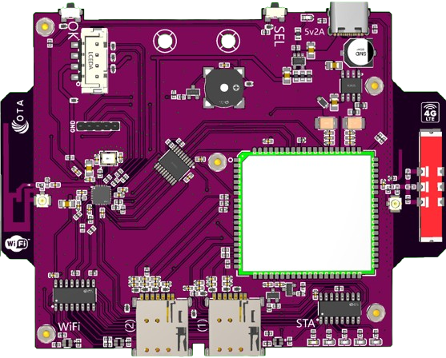
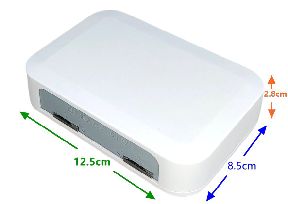

# 简介

---
- **页面ID**: 539
- **作者ID**: 1
- **创建时间**: 2025-06-04 21:18:42
- **分类ID**: 0
---

　　**绿邮® X系列开发板**是一款全功能的嵌入式双卡双待4G全网通开发板，基于C/C++和部分汇编开发。
  
　　使用**绿邮® X系列开发板**进行二次开发，不用考虑电压、信号、底层协议等繁琐的技术细节，可以简便的与各种高级语言（如Java、C#、Asp.net、Perl、PHP等）进行对接。
  
　　**绿邮® X系列开发板**将底层细节封装成了HTTP或TCP协议，以Form或Json格式与您的接口进行数据交互。开发板适用于各种行业，如政务、应急救援、保险、自动告警、移动通信等，可以帮助您快速开发新产品。
　　
  
　　
  　　
　　**完整产品图示：**

