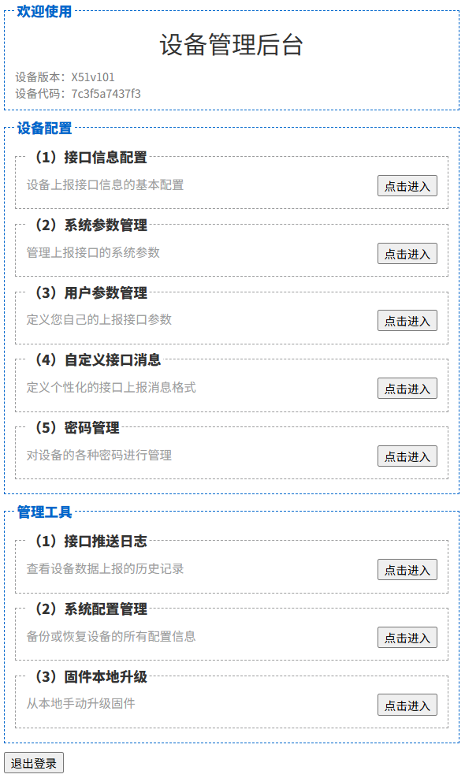

# 进入设备管理后台

---
- **页面ID**: 547
- **作者ID**: 1
- **创建时间**: 2025-06-04 21:32:44
- **分类ID**: 0
---

　　与家里使用的路由器类似，开发板也有一套“后台管理页面”。当开发板正确连上WIFI热点之后，您就可以登录到开发板的“设备管理后台”WEB页面，完成开发板相关的配置与管理工作。

####进入设备管理后的步骤：

　　（1）参照“快速入门”章节，开发板正确插卡、通电之后，给设备中的卡发送短信：
`*#addwf#000000#WiFi热点名#WiFi热点密码`
　　开发板收到包含有WIFI热点信息的“短信指令”后，会自动的搜索并连入指定的WIFI热点。（注意：热点必须是2.4G，不能是5G）

　　（2）参照“快速入门”章节中的“获取开发板的ＩＰ地址”一节，获取到当前开发板的IP地址，然后在浏览器中访问以下地址，进入到“设备管理后台”WEB页面。
    `http://192.168.7.170/mgr`
　　其中，此处的192.168.7.170是假设已经获取到的开发板IP地址，您实际获取到的IP地址可能与示例不同，实际使用时，请替换成您实际的IP地址即可。

　　（3）在浏览器中输入开发板后面管理页面的地址，登录到开发板后面管理页面。注意：首次登录时可能会提示您输入管理员名称、密码，以验证您的管理身份。开发板出厂默认的登录名称、密码分别是：admin、admin，您初次登录成功之后，可以在“设备管理后台”页面中修改默认的管理密码。
  
**设备管理后台图示如下：**

　
　　设备管理后台的首页主要包括三个部分：

　　第一部分是“**标题区域**”，包括了当前设备的版本号 以及 设备代码。设备代码是全球唯一的设备ID，每一张开发板都有一个全球唯一的ID标识。
  
　　第二部分是“**设备配置**”区域，通过设备配置的相关子功能，您可以完成诸如接口信息配置，系统运行参数配置、设备密码管理等相关的信息配置工作，方便您将开发板连入到您指定的接口或第三方平台中。
  
　　第三部分是“**管理工具**”区域，您可以通过开发板提供的管理工具功能，方便的对开发中的接口推送结果进行调试，或者是对开发板的配置信息进行统一的备份或恢复。
  
　　在后面的章节中，我们将向您介绍每一个功能的具体使用方法。
