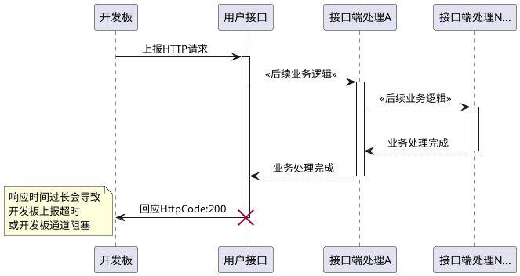

# 开发板数据交互指南

---
- **页面ID**: 565
- **作者ID**: 1
- **创建时间**: 2025-05-15 19:01:48
- **分类ID**: 180
---

###概要
　　开发板本身属于**资源受限的**嵌入式开发设备，开发板每一次向服务器端发送HTTP请求时，都会对开发板自身产生较高的资源占用。其中HTTPS占用最高，每次的HTTPS请求几乎需要占用50％左右的资源（大量的数据RSA加解密操作）。相较于HTTPS请求，每一次的HTTP请求的资源占用会小很多，而TCP接口的资源占用最小。
　　所以，当接口端（服务器端）收到开发板推送的数据后，应在**最短的时间内**完成数据接收并应答，尽快结束本轮的数据上报动作。
  ####以下是正确的应答流程：

  ```plantuml
@startuml
开发板 -> 用户接口: 　　　　　（1）上报HTTP请求
|||
用户接口 <--  用户接口: 　（2）缓存数据
note right
将开发板上报的数据进行缓存
（此时不要进行业务处理）
end note
|||
开发板 <- 用户接口 : 　　　（3）回应HTTPCode : 200　　　　
note left
确保在最短时间内
完成应答
end note
|||
用户接口 <-- 用户接口 : 　（4）接口端业务处理
note right
获取缓存的数据，
进行后续的业务逻辑处理
end note
@enduml
```
　
 　
  ####以下是错误的应答流程：

