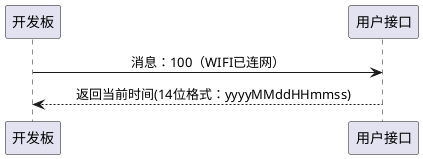
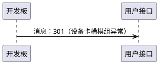
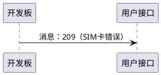
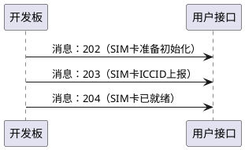
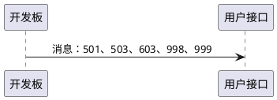
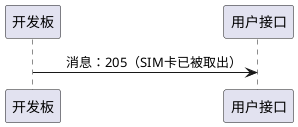

# 消息推送的顺序

---
- **页面ID**: 591
- **作者ID**: 1
- **创建时间**: 2025-05-15 21:29:55
- **分类ID**: 188
---

###推送消息的时序说明

####（1）推送消息：100
这是开发板通电开机，在成功连入了WIFI热点后，向您的接口推送的第一个消息，表示开发板已经联网成功。
**接口返回**：接口收到100消息后，可以向接口反馈14位纯文字时间，给开发板设置时钟**（可选）**。

14位时间格式为：年年年年月月日日时时分分秒秒，比如：20220218150605。

####请注意：
- 如果您的接口是HTTP方式，开发板向您的接口推送100消息时，您的HTTP接口Response可以不返回数据（此时开发板时间将是1970年1月1日）。但是，接口的WEB服务器返回的HTTP CODE值，必须为200，否则，开发板会自动尝试连接其它WIFI热点（如有），并重新推送100消息，直到HTTP CODE能够正确返回200。

- 如果您的接口是TCP方式，开发板向您的接口推送100消息时，您的接口 **必须** 返回以下格式的应答：
```
{"cmd":"now", "p1":"20220330184700", "tid":"1234"}\x11\x12
```
即，您的接口必须返回14位的当前时间做为应答。此应答必须在5秒内完成，否则将视为TCP链接建立失败。正常情况下，您的接口给出上述应答之后，开发板将再次回复一个“应答已收到”的消息给您的接口，格式如下：
```
{"code":0, "type":999, "netCh":0, "tid":"1234"}\x11\x12
```
至此，开发板与您的接口之间TCP网络建立成功。

　
####（2）推送消息：301
开发板开机并成功连入WIFI后，首先对开发板所搭载的通讯模组进行识别。
如果搭载的通讯模组识别未成功（比如开发板上未接入通讯模组，或通讯模组规格不能识别等），开发板会向接口推送301消息。
**接口返回**：无


　
####（3）推送消息：209
开发板对板载的通讯模组识别完成后，会对卡槽中的SIM卡进行识别。
如果SIM卡识别未成功（比如SIM卡损坏、SIM卡未插好等），开发板会向接口推送209消息。
**接口返回**：无

　
####（4）推送消息：202、203、204
开发板对卡槽中的SIM卡识别成功后，会对SIM卡进行一系列的初始化处理。
SIM的初始化过程中，开发板会根据初始化的进度，逐一向您的接口推送多个消息，对当前进度进行报告。
当所有初始化处理完成后，最终会推送204消息，表示SIM已经就绪。此时，SIM已经可以的正常接打电话、收发短信。
**接口返回**：无



　
####（5）推送消息：501、502、603、998、999
当SIM已就绪之后，开发板在正常运行的过程中，如开发板收到新短信等事件时，会主动向您的接口推送消息。
- 501消息表示开发板收到了新短信。
- 502消息表示开发板外发短信成功。
- 603消息表示开发板收到新来电。
- 998消息表示开发板主动推送的周期PING消息，报告网络链接正常。
- 999消息表示开发板对执行**控制消息**的结果反馈。
**接口返回**：无



　
####（6）推送消息：205
当SIM已就绪之后，开发板在正常运行的过程中，用户主动取出了卡槽中的SIM卡时，开发板向接口报告205消息。
**接口返回**：无

　
####（7）开发中的注意事项
您的接口并不需要对每一种消息，都进行接收。实际上，您只需要接收您关心的消息就可以了。您的接口处理的消息**越少越好**。举例：如果您只关心接收短信的话，您只需要接收501一种消息就可以了。
