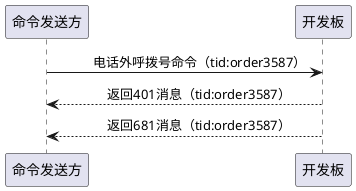

# 其它设置

---
- **页面ID**: 554
- **作者ID**: 1
- **创建时间**: 2025-05-15 18:51:59
- **分类ID**: 174
---

　　“**其它设置**”是与开发板接口相关的一些附加选项，用户可以根据自身的需要进行设置。
　　

####其它设置界面：


　
　　（1）**401消息超时时间：**当向开发板发送“命令”时，如果“命令”中带有tid字段表示命令的“发送方”需要对本次发送的命令进行确认，当开发板收到带有tid字段的“命令”时，会立即向接口上报“命令已收到”的应答消息。

 　
　　（2）**PING消息间隔：**此设置用于为998消息设置一个周期上报的时间。比如您如果设置为60，表示开发板每间隔60秒，会向接口上报一次998消息。
> **注意：**
　　在使用手机卡网络联网时，此值不宜设置的过大。否则在运营商层面上，会被认为手机卡所创建的TCP链接已经超时，运营商会主动切断手机卡网络的TCP链接。默认情况下此值为110秒，通常情况下这个值是合适的。

　　
　　（3）**JSON控制字符转普通字符：**控制字符一般是指例如：制表符(0x09)、换行符（0x0a)等特殊字符。在标准的JSON中是不允许直接出现这种特殊符号的。例如以下JSON格式：
  ```json
{
	"smsBody" : "您好
	这是示例"
}
  ```
　　在上例中，“您好”与“这是示例”之间有一个换行符。
　　在JSON的标准规范中，这是不允许的。然而在实际使用中，目前大多数流行的JSON库，都能够自动处理这种情况，并不会认为是非法的JSON格式。但是仍有一部分JSON库不会自动处理，而是直接报告JSON格式非法。

　　为了适应这种情况，您可以勾选本选项，由开发板在向接口上报数据之前，事先将其转换为标准的JSON格式。在前述示例中，如果勾选了本选项，处理的结果是：
```json
{
	"smsBody" : "您好\n这是示例"
}
```

> **注意：**
　　此选项默认是不勾选的。通常而言，我们建议您不需要修改此选项的默认设置。只有在您的JSON库明确的处理不了此种问题时，再考虑开启本选项。

